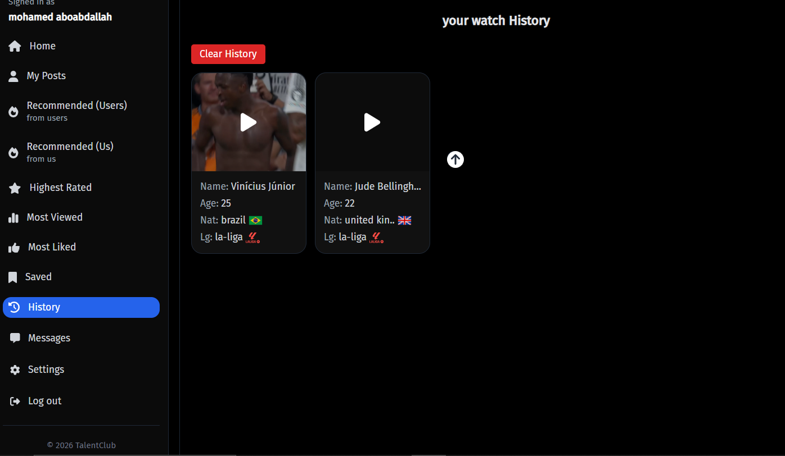
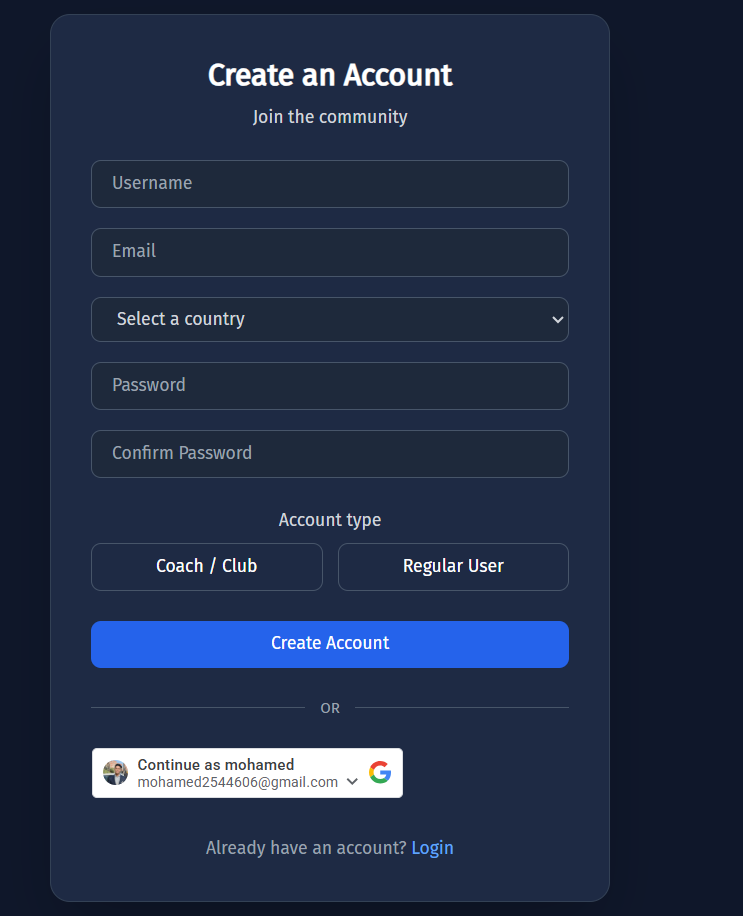
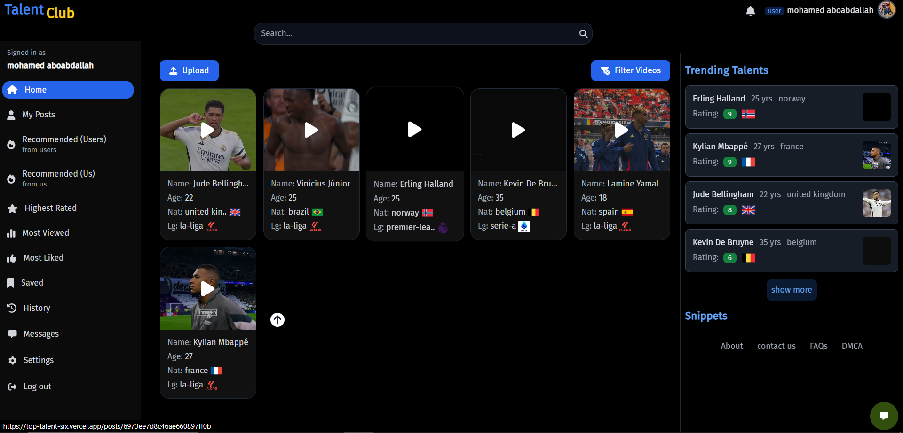

# ⚽ Top Talent – Football Talent Discovery Platform

Top Talent is a full-stack web platform (similar to YouTube) designed for discovering football talents.

Users can upload videos, explore players, interact with content, and engage through likes, comments, and real-time features.

---

## 🌐 Live Demo

👉 https://top-talent-six.vercel.app/login

---

## 🚀 Key Features

### 👤 Authentication & User System

* Secure authentication (Email/Password + Google OAuth)
* User profiles with editable information
* Account types (User / Coach / Club)

---

### 🎥 Video Platform (Core Feature)

* Upload football talent videos
* Video streaming & playback
* Media gallery & related content
* Watch history tracking

---

### 🔍 Discovery & Filtering

* Search functionality
* Advanced filters (country, league, age, etc.)
* Categorized content:

  * Most viewed
  * Most liked
  * Highest rated
  * Recommended

---

### ❤️ Social Interactions

* Like & react to videos
* Comment system
* Save videos
* Share content

---

### ⚡ Real-Time Features

* Messaging system (Socket.IO)
* Live updates

---

### 📊 User Dashboard

* Personal content management
* History tracking
* Saved videos
* Profile editing

---

## 🛠️ Tech Stack

### 🎨 Frontend

* React 18 + Vite
* TailwindCSS
* Zustand (state management)
* React Router
* Framer Motion (animations)

---

### ⚙️ Backend

* Node.js + Express
* MongoDB (Mongoose)
* JWT Authentication
* REST API architecture

---

### ☁️ Media & Processing

* Cloudinary (video/image storage)
* Multer (file uploads)
* FFmpeg (video processing)

---

### 🔐 Auth & Security

* Google OAuth
* bcrypt (password hashing)
* cookie-parser

---

### 🔄 Real-Time

* Socket.IO

---

### 🚀 Other Tools

* Redis (caching)
* Axios
* dotenv

---

<p align="center">
  
</p>
<p align="center">
  
</p>
<p align="center">
  
</p>
<p align="center">
  
</p>
<p align="center">
  
</p>
<p align="center">
  
</p>
<p align="center">
  
</p>
<p align="center">
  
</p>

## 📂 Project Structure

```bash
frontend/
backend/

frontend/src/
 ├── components/
 ├── pages/
 ├── store/
 ├── hooks/

backend/
 ├── controllers/
 ├── routes/
 ├── models/
 ├── middleware/
```

---

## ⚙️ Getting Started

### 1. Clone the repository

```bash
git clone https://github.com/mo2002222/top-talent.git
cd top-talent
```

---

## ▶️ Run Backend

```bash
cd backend
npm install
npm run dev
```

Create `.env` file:

```
PORT=
MONGO_URI=
JWT_SECRET=
CLOUDINARY_NAME=
CLOUDINARY_API_KEY=
CLOUDINARY_API_SECRET=
GOOGLE_CLIENT_ID=
REDIS_URL=
```

---

## 💻 Run Frontend

```bash
cd frontend
npm install
npm run dev
```

---

## 🚀 Deployment

* Frontend deployed on **Vercel**
* Backend can be deployed on:

  * Render
  * Railway
  * VPS

---

## 🎯 Future Improvements

* 🎯 AI-based talent ranking
* 🤖 Smart video recommendations
* 📈 Analytics dashboard for players
* 💬 Advanced chat system
* 🎥 Live streaming

---

## 💼 Use Cases

* Football players showcasing their skills
* Coaches & clubs discovering talents
* Sports communities sharing content
* Freelance project for media platforms

---

## 📬 Contact

Open to:

* Job opportunities
* Freelance work
* Collaboration

---

## ⭐ Support

If you like this project, give it a star ⭐
